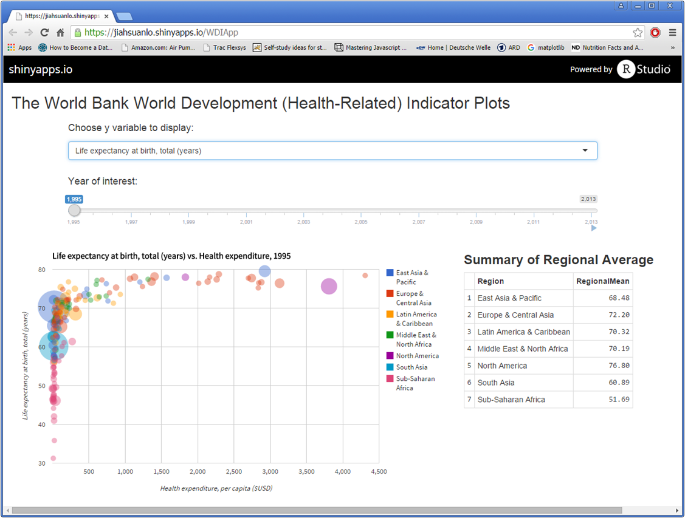
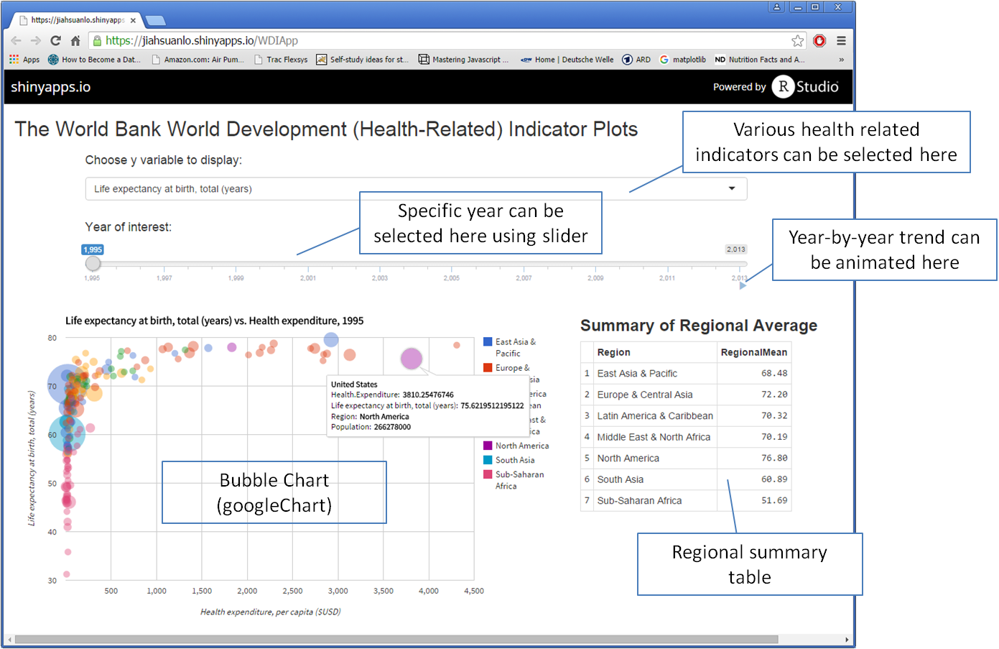

## Introdution

1. This Shiny App serves as a plotting tool for health-related, World Development Indicator (WDI). 
2. The WDI data was obtained from:
    + [The World Bank World Development Indicators](http://data.worldbank.org/topic/health#tp_wdi)
3. Each indicator data versus health expenditure per capita is illustrated as scattered bubble charts (googleChart).

--- .class #id .codefont

## Data PreProcessing

The raw data was in the wide format that indicators were in rows and years were in columns. To make the data easier to work with, data was re-arranged to the long format so that each indicator has its own column...</p>


```r
library(dplyr)
library(tidyr)
rawdata<- read.csv("./WDIApp/data/8_Topic_en_csv_v2.csv",
                   stringsAsFactors = FALSE, skip=4, sep = ",",fileEncoding="UTF-8-BOM")

# re-arrange data so that each indicator is a column
cleandata<- rawdata[1:1000,] %>%
    gather(year,value,X1960:X2015) %>%
    spread(Indicator.Code, value)
names(cleandata)[1:10] # show some sample variable names
```

```
##  [1] "Country.Name"   "Country.Code"   "Indicator.Name" "X"             
##  [5] "year"           "SG.VAW.ARGU.ZS" "SG.VAW.BURN.ZS" "SG.VAW.GOES.ZS"
##  [9] "SG.VAW.NEGL.ZS" "SG.VAW.REAS.ZS"
```

So now the indicators are in the columns, and the data is easier to process. 

--- .class #id 

## How to Launch The App

The Shiny App can be accessed at the following website [https://jiahsuanlo.shinyapps.io/WDIApp](https://jiahsuanlo.shinyapps.io/WDIApp)

<center>  </center>

--- .class #id

## How to Use the App

The GUI of the App is illustrated in the following figure

<center>  </center>


--- .class #id

## Summary

The World Bank World Development (Health-Related) Indicator plotting app provides the following features:

1. Allowing users to quickly select and show the indicator of interests
2. Illustrating the relation between selected indicator and health expenditure
3. Demonstrating the difference among countries and regions.
4. Showing the trend of selected indicator over time by animating the chart.


